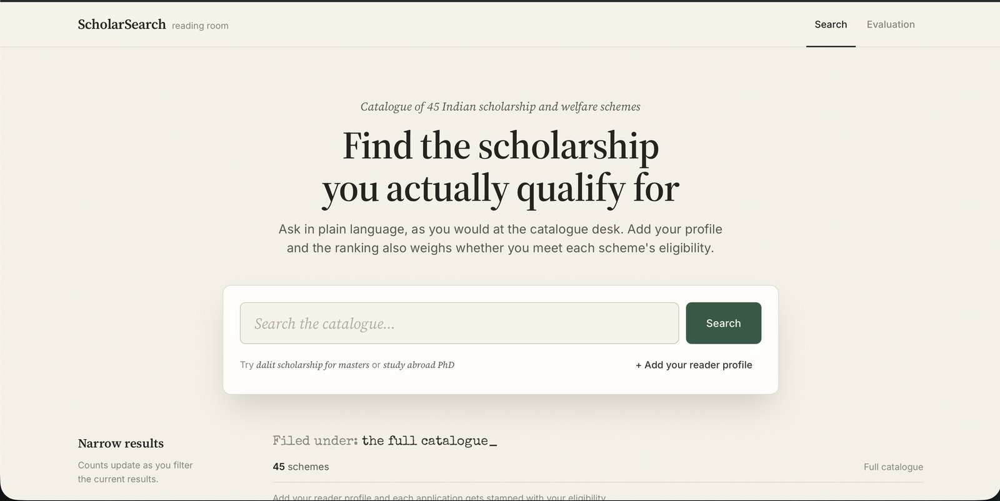
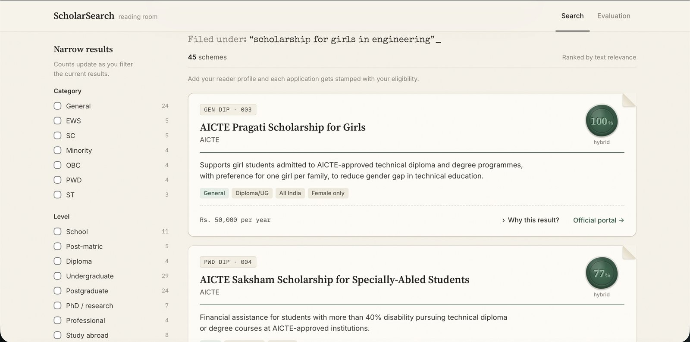
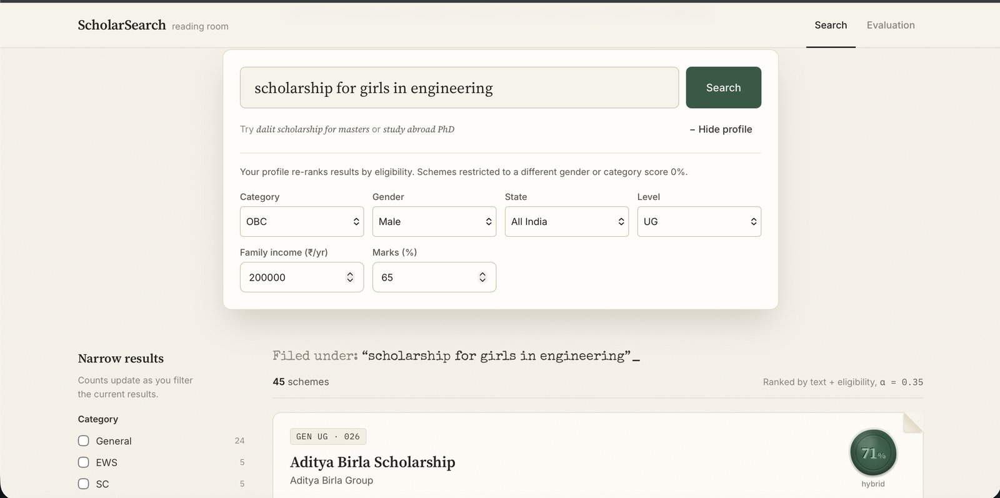
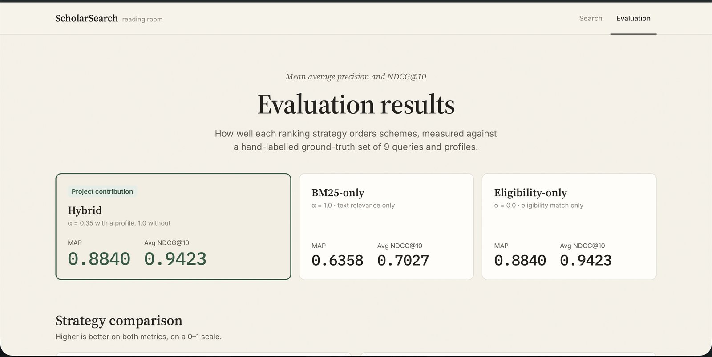
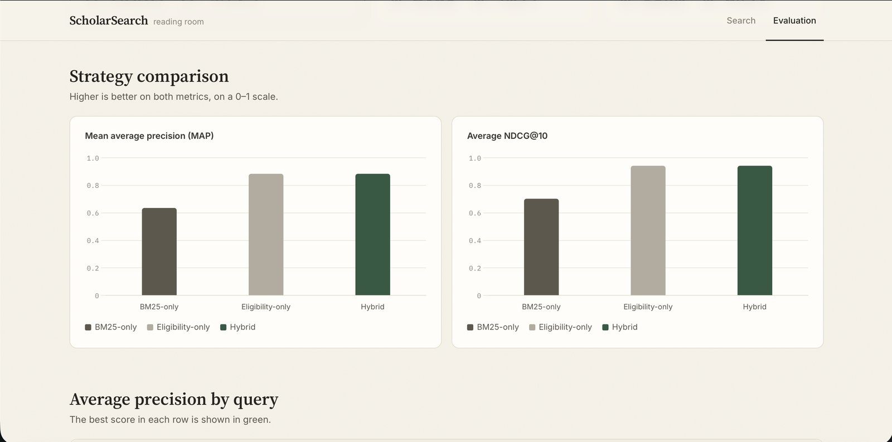
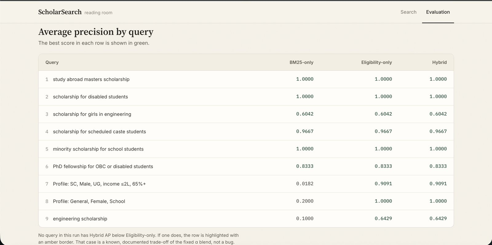
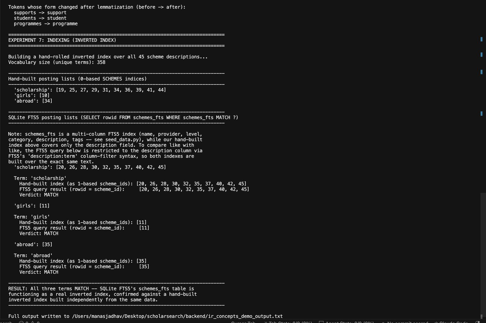
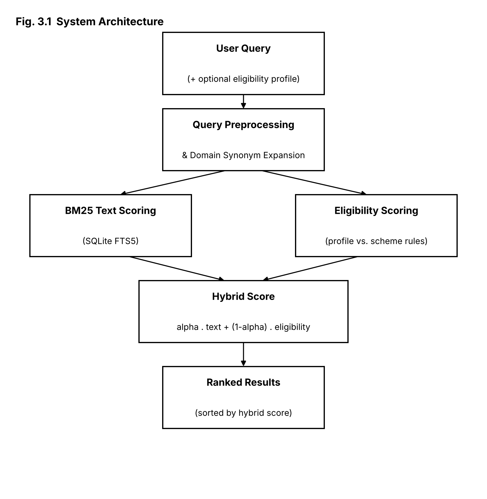

# ScholarSearch

A hybrid information-retrieval engine for discovering Indian government and
private scholarships / welfare schemes — built as an Information Retrieval
mini-project.

Most scholarship search tools are either a static filtered list or plain
keyword search with no sense of whether the user actually *qualifies*.
ScholarSearch combines classical text retrieval (BM25 over an inverted
index) with a structured eligibility-matching layer, so a search for
"engineering scholarship" with a profile attached doesn't just return
anything mentioning "engineering" — it ranks schemes the user can actually
apply to above ones they can't.

By Manas Jadhav, St. Francis Institute of Technology, Mumbai

---

## Table of Contents

- [The core idea](#the-core-idea)
- [Features](#features)
- [Screenshots](#screenshots)
- [System architecture](#system-architecture)
- [Tech stack](#tech-stack)
- [Project structure](#project-structure)
- [Getting started](#getting-started)
- [API reference](#api-reference)
- [Evaluation](#evaluation)
- [What's original here](#whats-original-here)
- [Known limitations](#known-limitations)
- [Future work](#future-work)
- [References](#references)

---

## The core idea

ScholarSearch ranks every scheme against a query with a single hybrid
formula:

```
hybrid_score = alpha * text_relevance(query, scheme)
             + (1 - alpha) * eligibility_match(profile, scheme)
```

- **text_relevance** — SQLite FTS5's BM25 ranking over scheme name,
  provider, level, category, description and tags, after a domain-specific
  query-expansion pass (e.g. "dalit" → SC, "adivasi" → ST, "poor" → EWS).
- **eligibility_match** — a structured 0–1 score built from how well the
  user's category / gender / state / income / marks / education level line
  up with each scheme's stated eligibility rules. Gender and category are
  **hard disqualifiers** (a mismatch forces the score, and therefore the
  final hybrid score, to 0); state, income, marks and level are **soft**
  partial-credit criteria.
- **alpha** shifts automatically depending on context: `1.0` for a pure
  text query with no profile (eligibility can't be scored without one),
  `0.35` (favouring eligibility) once a profile is supplied.

The two signals are computed independently and only combine at the very
last step — see [System architecture](#system-architecture).

## Features

- 🔍 **Free-text search** over 45 real, curated Indian scholarship/welfare
  schemes — central government (National Scholarship Portal categories,
  AICTE Pragati/Saksham, PM YASASVI), Maharashtra state schemes, major
  private foundations (Tata, Reliance, Aditya Birla, Inlaks), and
  study-abroad fellowships (Fulbright-Nehru, Chevening, Commonwealth, DAAD).
- 🎯 **Profile-based eligibility matching** — enter category, gender,
  state, family income, academic percentage and education level to get
  results re-ranked by how well you actually qualify, not just keyword
  overlap.
- 🧠 **Domain-specific query expansion** — scholarship vernacular and
  regional/category terms are expanded before matching, instead of relying
  on generic English synonyms.
- 📊 **Built-in evaluation dashboard** — summary cards, comparison charts,
  and a per-query results table comparing BM25-only, eligibility-only and
  hybrid ranking on a 9-query ground-truth set.
- 🗂️ **Multi-category eligibility parsing** — schemes like "SC/ST/PWD" list
  several eligible categories; the matcher splits and checks overlap rather
  than doing an exact string match.
- ⚡ **No build step on the frontend** — a single `index.html` file, no
  bundler, no framework.

## Screenshots

**Home / search interface**



**Plain text search results (no profile — pure BM25 ranking)**



**Profile-based eligibility-matched results**

Same query, this time with an eligibility profile attached — the ranking
changes to favour schemes the user can actually apply to.



**Evaluation dashboard — summary cards**



**Evaluation dashboard — comparison charts**



**Evaluation dashboard — per-query results table**



**Terminal verification — preprocessing & inverted-index cross-check**

A standalone script hand-builds an inverted index from the raw scheme text
and cross-verifies it term-by-term against the production SQLite FTS5
index, including a documented tokenizer discrepancy (SQLite FTS5 splits on
hyphens; NLTK's tokenizer does not).



## System architecture



The pipeline separates two concerns: an **offline indexing stage** (scheme
records → preprocessing → SQLite FTS5 inverted index) and a **query-time
ranking stage**, in which a user's query and optional profile are scored by
two independent signals that are only blended into one ranking at the very
last step (`Hybrid Score = alpha · text + (1 - alpha) · eligibility`).

## Tech stack

| Layer | Technology |
|---|---|
| Backend | Python 3, Flask |
| Search index | SQLite FTS5 (BM25 built in) |
| Text preprocessing | NLTK (tokenization, stop-word removal, lemmatization) |
| Frontend | Vanilla HTML/CSS/JS — single file, no build step |
| Evaluation | Custom MAP / NDCG@10 scorer against a 9-query ground-truth set |

## Project structure

```
scholarsearch/
├── backend/
│   ├── app.py              Flask API (search, filters, stats, health)
│   ├── schemes_data.py     45 real scholarship/scheme entries (curated)
│   ├── seed_data.py        Builds scholarsearch.db with FTS5 + triggers
│   └── requirements.txt
├── frontend/
│   └── index.html          Single-file vanilla JS UI, no build step needed
└── docs/
    ├── architecture.png    System pipeline diagram
    ├── evaluation-chart.png   Per-query AP comparison chart
    └── screenshots/        UI + dashboard + terminal screenshots
```

## Getting started

### Prerequisites

- Python 3.9+
- pip

### Setup

```bash
cd backend
pip install -r requirements.txt
python3 seed_data.py        # builds scholarsearch.db (run once, or after editing schemes_data.py)
python3 app.py               # starts API on http://127.0.0.1:5001
```

Then open `frontend/index.html` directly in a browser, or serve it so
relative paths resolve cleanly:

```bash
cd frontend
python3 -m http.server 3000
```

and visit `http://localhost:3000`.

## API reference

| Method | Endpoint | Purpose |
|---|---|---|
| POST | `/api/search` | `{query, profile}` → hybrid-ranked results |
| GET | `/api/schemes` | Paginated list of all schemes |
| GET | `/api/schemes/<id>` | Single scheme detail |
| GET | `/api/filters` | Distinct categories/states/levels for dropdowns |
| GET | `/api/stats` | Counts by category / level / state |
| GET | `/api/health` | DB connectivity check |

**Example — plain text search (no profile):**

```bash
curl -X POST http://127.0.0.1:5001/api/search \
  -H "Content-Type: application/json" \
  -d '{"query": "engineering scholarship for sc students"}'
```

**Example — with an eligibility profile:**

```bash
curl -X POST http://127.0.0.1:5001/api/search \
  -H "Content-Type: application/json" \
  -d '{
        "query": "engineering scholarship",
        "profile": {
          "category": "SC",
          "gender": "Male",
          "state": "Maharashtra",
          "income": 150000,
          "marks": 82,
          "level": "Undergraduate"
        }
      }'
```

Response shape (abridged):

```json
{
  "results": [
    {
      "id": 17,
      "name": "AICTE Pragati Scholarship for Girls",
      "provider": "AICTE",
      "text_score": 4.21,
      "eligibility_score": 0.92,
      "hybrid_score": 1.80,
      "alpha": 0.35
    }
  ]
}
```

## Evaluation

Evaluated against a 9-query ground-truth test set using standard IR
metrics (MAP, NDCG@10), comparing three ranking modes:

| Ranking mode | MAP | Avg. NDCG@10 |
|---|---|---|
| BM25-only (text, no eligibility) | 0.6358 | 0.7027 |
| Eligibility-only | 0.8840 | 0.9423 |
| **Hybrid** (text + eligibility) | **0.8840** | **0.9423** |

The gap is largest on eligibility-driven queries: Query 7's BM25-only
Average Precision was **0.018**, versus **0.909** for hybrid/eligibility-
aware ranking on the same query — see
`docs/evaluation-chart.png` and the per-query table screenshot above.

A real scoring defect was found during this evaluation (gender/category
were being treated as soft, partial-credit criteria instead of hard
disqualifiers), fixed, and re-verified with before/after metrics — Hybrid
MAP improved from 0.8434 to 0.8840 with no regression elsewhere.

## What's original here

1. **Hybrid text + eligibility ranking** — the core contribution. The two
   signals are computed completely independently and only merge at the
   final scoring step.
2. **Domain-specific query expansion** for scholarship vernacular rather
   than generic English synonyms.
3. **Multi-category eligibility parsing** — schemes like "SC/ST/PWD" list
   several eligible categories; the matcher splits and checks overlap
   rather than exact string equality.
4. **Hard vs. soft eligibility criteria** — gender/category disqualify
   outright; state/income/marks/level contribute partial credit.

## Known limitations

- Eligibility figures (income caps, benefit amounts) are representative
  snapshots for demonstrating the retrieval/ranking logic, not a live feed
  from government portals. A real deployment should sync from the
  National Scholarship Portal (scholarships.gov.in) and state DBT portals.
- 45 schemes demonstrate the retrieval/ranking logic end-to-end; scaling to
  the full 1,000+ schemes available nationally would need a scraper/ETL
  pipeline.
- The hybrid blending weight (`alpha = 0.35`) was chosen as a reasonable
  initial value, not tuned against the evaluation data.
- BM25 is the only text-ranking algorithm implemented; no Vector Space
  Model (TF-IDF + cosine similarity) comparison yet.
- No user accounts or saved searches — out of scope for the IR focus here.

## Future work

- Scale the dataset via a live scraper against the National Scholarship
  Portal and state DBT portals.
- Run an empirical sweep of `alpha` against the ground-truth set to find
  the weighting that maximises MAP.
- Add a second ranking algorithm (TF-IDF + cosine similarity) for a direct
  BM25-vs-VSM comparison.
- Add pattern-matching search modes (prefix, suffix, fuzzy/edit-distance)
  for partial or misspelled queries.

## References

- S. Robertson and H. Zaragoza, "The Probabilistic Relevance Framework:
  BM25 and Beyond," *Foundations and Trends in Information Retrieval*,
  vol. 3, no. 4, pp. 333–389, 2009.
- C. D. Manning, P. Raghavan, and H. Schütze, *Introduction to Information
  Retrieval*. Cambridge University Press, 2008.
- [SQLite FTS5 Extension](https://www.sqlite.org/fts5.html)
- [National Scholarship Portal, Government of India](https://scholarships.gov.in)
- [NLTK Project Documentation](https://www.nltk.org)
